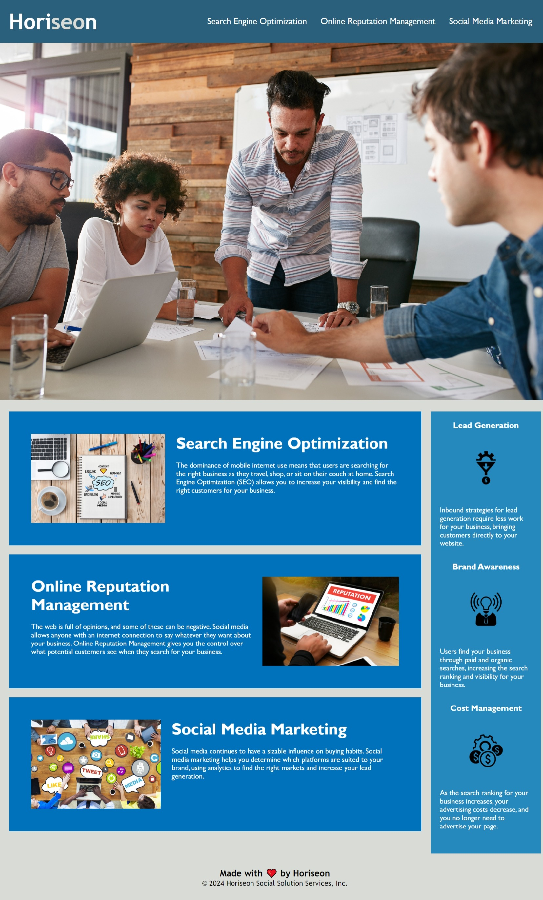

## Description

Provide a short description explaining the what, why, and how of your project. Use the following questions as a guide:

- What was your motivation?

I was motivated mainly by my wife who is also going to school at the moment. I am also motivated because i want to be able to work from home and be able to support my family financially so we can have a fun and adventurous lifestyle.
- Why did you build this project? (Note: the answer is not "Because it was a homework assignment.")

I built this project because I want to have many projects in my portfolio to show employers that I am able to do the job and make an impact in the company.
- What problem does it solve?

This project solves the problem with my status of having no experience and knowledge of coding to having one project in my portfolio. A portfolio showing my new skills and abilities to adapt to the new challenges. 
- What did you learn?

I learned that I am capable of so much and cannot wait to see what cool projects I can create with the new skills and relationships I will develope.

## Table of Contents (Optional)

If your README is long, add a table of contents to make it easy for users to find what they need.

- [Installation](#installation)
- [Usage](#usage)
- [Credits](#credits)
- [License](#license)

## Installation

What are the steps required to install your project? Provide a step-by-step description of how to get the development environment running.
1. Choose a code editor to write out the code and connect the files to each other.
2. Set up (github) an online way to store and track the changes you make. It also helps to have a way to track your changes/commits to go back to in case there is a change that alters the outcome of the website.
3. Connect the local(computer) files and code with the online version control (github). 
4. There are frameworks and tools available to help save some time creating CSS and framework prepocessor.
5. Once you think you are ready to set the project out for everyone, take a step back and make sure to debug the website making sure there is no surprises when using the website. 
6. Look for ways to optimize using plug ins and semantic code to allow for the website to be working with 0 issues.

## Usage

Provide instructions and examples for use. Include screenshots as needed.

To add a screenshot, create an `assets/images` folder in your repository and upload your screenshot to it. Then, using the relative filepath, add it to your README using the following syntax:

    ```md
    
    ```

## Credits

List your collaborators, if any, with links to their GitHub profiles.

If you used any third-party assets that require attribution, list the creators with links to their primary web presence in this section.

If you followed tutorials, include links to those here as well.

## License

The last section of a high-quality README file is the license. This lets other developers know what they can and cannot do with your project. If you need help choosing a license, refer to [https://choosealicense.com/](https://choosealicense.com/).

---

🏆 The previous sections are the bare minimum, and your project will ultimately determine the content of this document. You might also want to consider adding the following sections.

## Badges


Badges aren't necessary, per se, but they demonstrate street cred. Badges let other developers know that you know what you're doing. Check out the badges hosted by [shields.io](https://shields.io/). You may not understand what they all represent now, but you will in time.

## Features

If your project has a lot of features, list them here.

## How to Contribute

If you created an application or package and would like other developers to contribute it, you can include guidelines for how to do so. The [Contributor Covenant](https://www.contributor-covenant.org/) is an industry standard, but you can always write your own if you'd prefer.

## Tests

Go the extra mile and write tests for your application. Then provide examples on how to run them here.
